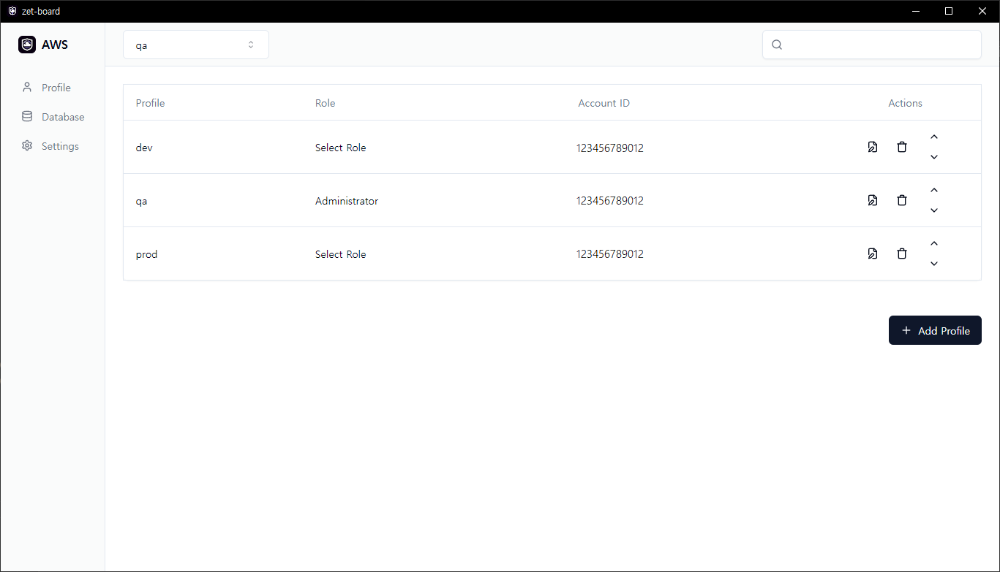

# ZeT Board

ZeT Board is a desktop application for AWS tunneling, aiming to implement Zero Trust through role-based authentication in AWS.

> Desktop Preview




## Key Features

- **Zero Trust Security**: Provides secure access to AWS resources through role-based authentication.
- **Easy Setup**: User-friendly interface for straightforward AWS tunneling configuration.
- **Multi AWS Services Support**: Supports integration with multiple AWS services for efficient management.

## Getting Started

### Prerequisites

Before using ZeT Board, make sure you have the following installed:

- Node.js (version 20 or higher)
- npm (version 10 or higher)
- An AWS access key and a configured AWS role with permissions for accessing the necessary resources.
- A bastion host configured for access via AWS Systems Manager (SSM) session start, to facilitate secure access and management.


### Installation

1. Clone the ZeT Board repository from GitHub:

```bash
git clone https://github.com/Jaeminst/zet-board.git
```

2. Navigate to the application directory and install the required packages:

```bash
cd zet-board
npm install
```

3. Start the application in development mode:

```bash
npm run dev
```

This command runs the application in development mode. For production, you may need to build or package the application, which can be done as described in the packaging section below.

## Packaging the Application

To package the application for production:

```bash
npm run package
```

This command compiles the application into an executable package for your platform, making it ready for distribution and use in a production environment.

## Usage

[This section explains the basic usage of the application, such as how to log in, change settings, and perform specific tasks.]

## Contributing

Contributions to the ZeT Board project are welcome! If you would like to contribute, please follow these steps:

1. Fork the project.
2. Create your feature branch (`git checkout -b feature/AmazingFeature`).
3. Commit your changes (`git commit -m 'Add some AmazingFeature'`).
4. Push to the branch (`git push origin feature/AmazingFeature`).
5. Open a pull request.

## License

This project is distributed under the MIT License. See the `LICENSE` file for more details.

## Contact

If you have any questions or suggestions about ZeT Board, please open an issue in the [issue tracker](https://github.com/Jaeminst/zet-board/issues).
